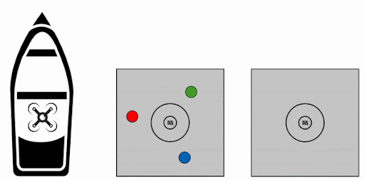
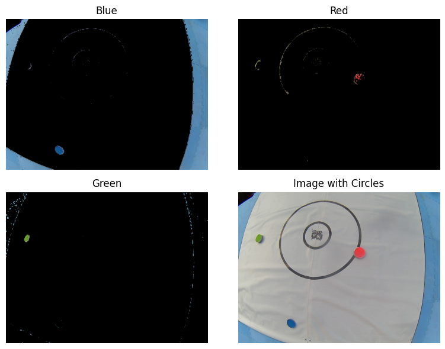
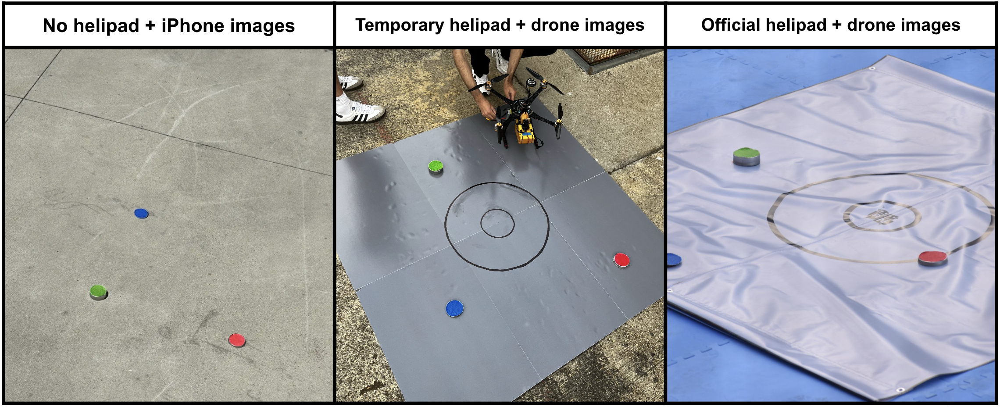
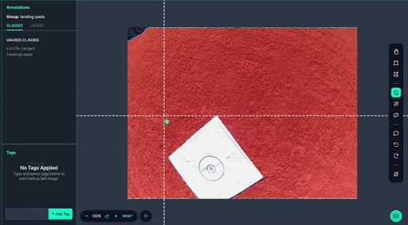

# UAV Drone Replenishment Project

## Overview
The UAV Drone Replenishment project aims to develop an autonomous drone system capable of performing object detection and manipulation tasks in challenging environments. This project is part of Triton AI, a UC San Diego organization participating in RoboNation's 2024 RobotX Maritime Challenge. This project was conducted under the guidance of Professor Kastner and fellow staff for CSE 145 (Embedded System Design Project) during the Spring 2024 quarter.

<div align="center">
    
</div>


## Team Members
- Alec Digirolamo
- Daniel Sanei
- Carson Rae
- Soumi Chakraborty

## Project Structure
- Hardware: Jetson Nano, Pixhawk, Arducam
- Software: ROS2 Humble, OpenCV, ArduCopter, PyTorch, SITL Simulator
- Ground Control Station: QGroundControl
- Object Detection: YOLOv5, OpenCV

## Repository Organization
- /admin: Administrative documents, including reports, documentation, presentations
- /code: Source code for the project
- /images: Images used throughout the repository

## Codebase Details
### Object Detection
- [/code/object-detection](code/object-detection): Python notebook and readme with intructions for [curating custom dataset](code/object-detection/build_custom_dataset.md) and [training a custom YOLOv5 model](code/object-detection/train_custom_yolov5.ipynb).
### Jetson Nano
- [/code/jetson-nano/arducam](code/jetson-nano/arducam): Python scripts to take images and videos using downward-facing mounted Arducam
- [/code/jetson-nano/control](code/jetson-nano/control): Flight control software
- [/code/jetson-nano/miscellaneous](code/jetson-nano/miscellaneous): Other Python scripts and files
- [/code/jetson-nano/ros](code/jetson-nano/ros): Volume mount for ROS2 Humble host machine workspace
- [/code/jetson-nano/terminal](code/jetson-nano/terminal): Useful terminal commands

## Media
The images and videos taken from our Arducam and various drone flight tests can be accessed from the following link:
- [Image and Video Storage](https://drive.google.com/drive/folders/1x5Ip4g3WwqQiWM1Pjkvi5ud1pZbha7pc?usp=sharing)

## Object Detection
<!-- For replicating our object detection for this project, we have created two tutorials to follow along. The first provides an overview of how to build a custom dataset on RoboFlow, and the second covers how to train a YOLOv5 model based on custom objects. Both tutorials are located in the following directory:
- /code/object-detection -->
<!-- Our project included two object detection tasks:
- Tin can detection
- Helipad detection -->

The main deliverable of our project was the computer vision algorithm that would be running on the drone. We separated the object detection into two separate tasks which have been briefly described below. Steps to replicate these tasks have been described in detail in [code/object-detection](code/object-detection).

#### Helipad Detection
This task involved detecting the helipads the drone would have to deliver a tin can between. The drone would first have to detect one such helipad to pick up a tin can from, and then deliver the can to another such helipad. We used a YOLOv5 model for this task on a dataset collected by our drone's downward-facing ArduCam camera. The data collection, training pipeline and model deployment of this task have been described in depth in [/code/object-detection/train_custom_yolov5.ipynb](/code/object-detection/train_custom_yolov5.ipynb).
<!-- 
<div align="center">
    
</div> -->
<div align="center">
    
    
</div>


#### Tin Can Detection
For this task, our drone was required to detect red, blue and green colored tin cans. Since the cans are all RGB and circles of the same size, we decided to downgrade from a YOLO model and use a simple OpenCV algorithm that uses an HSV color scale to find contours. This task is still under development, but the skeleton algorithm can be found in [code/object-detection/detect_circle.ipynb](code/object-detection/detect_circle.ipynb).
<div align="center">
    
</div>

### Data Collection
#### Stage 1
To start, we created a temporary tin can dataset by placing three colored tin cans down around campus and **taking photos with an iPhone** from a high vantage point. This was an attempt to simulate the conditions that the drone would encounter on its missions using the high vantage point and concrete colored background. However, this dataset was created with a significant oversight: the camera used on the drone is an Arducam, not an iPhone. iPhones take much higher quality photos than the Arducam and are less wide lensed than the fisheye lens of the Arducam. Unfortunately, these factors meant that this dataset could not be used to train the model used on the drone in competition, but it did allow us to test the capabilities of our Yolov5 model in tin can detection and learn how to deploy the model on the drone. 

#### Stage 2
Next, we learned from our mistakes on the first tin can detection dataset and worked to build a helipad detection model using images from the Arducam. To do this, we set up a python script to take a photo once a second and flew our drone above a makeshift helipad in many conditions. The makeshift helipad was made in lieu of the real one by taping 6 grey posters together and drawing circles onto the landing pad to scale. This dataset allowed us to train a detection model on competition similar conditions and worked on the real helipad once we were able to get it printed. 

#### Stage 3
Finally, we were able to get our real helipad printed and repeated the data collection procedure, with tin cans on the helipad. At this point, we realized that it made more sense to use OpenCV for tin can detection, so we no longer needed a tin can dataset, but we wanted to simulate the noise that the RGB cans would cause in a helipad model. 

<div align="center">
    
</div>

### Annotation 
Once dataset collection and curation is completed, the next step is to annotate the dataset on Roboflow. Annotation means **creating ground truths** of where the objects that we are looking to detect are located on the image. We used Roboflow’s smart polygon tool to highlight two objects: the `helipad` and the centered `circle-targets`. We annotated more than 1500 images over several iterations of our dataset in order to curate a diverse dataset for our model to train on. 

<div align="center">
    
</div>

## Replication

### Jetson Nano
The Jetson Nano is a computer for embedded applications and AI IoT that operated as the brains of our drone. To gain access to this small computer, connect the Jetson Nano to an external monitor, keyboard, and mouse, and ensure a valid WiFi connection (if your Jetson Nano does not have a WiFi module, you may use a wired ethernet connection). Depending on your preferences, you may SSH into the Jetson Nano to work from your personal computer as well, given that both devices are on the same network. To flash and set up your Jetson Nano, follow this guide by NVIDIA:
- [Get Started With Jetson Nano Developer Kit](https://developer.nvidia.com/embedded/learn/get-started-jetson-nano-devkit)

### ROS2 Humble Docker Container
In our project, we advised to use ROS2 Humble for the development environment. However, our host machine (the Jetson Nano) was flashed with Ubuntu 18.04 version, whereas ROS2 Humble required Ubuntu 22.04 version. To resolve this conflict, we pulled a Docker image for ROS2 Humble, and ran the container to continue development. <br/><br/>
More in-depth details and instructions can be found in the [Jetson Nano Documentation](https://github.com/danielsanei/uav-replenishment/blob/b42760e34546f4c06329e9983a741f20d9fe8993/admin/documentation/Jetson%20Nano.pdf) within `/admin/documentation`. For simple instructions, please refer to the following:
1. Open a terminal window inside the host machine's Ubuntu 18.04 version. To pull the Docker image with Ubuntu 22.04 version for ROS2 Humble: 
```
docker pull dustynv/ros:humble-ros-base-l4t-r36.2.0
```
2. There are a few ways to run the Docker container, which are outlined inside the Jetson Nano documentation. For this guide, we will continue with the essential steps, and please feel free to refer to our documentation for various configurations. Use this simple command to start the Docker container:
```
docker run --runtime nvidia -it --network=host dustynv/ros:humble-ros-base-l4t-r36.2.0
```
3. Now, you have successfully pulled and ran the Docker container for the ROS2 Humble environment. However, since Docker containers are ephemeral, changes inside this container do not persist after the container stops. Therefore, we will use volume mounts to link files from the Docker container to the host machine, so that they are not lost. <br/><br/>
To set up a volume mount, create a workspace directory in the host machine, and another within the Docker container (you may need to restart the Docker container for this step). To set up the volume mount, change the file ownership:
```
sudo chown -R [INSERT-HOST-MACHINE-USERNAME]:[INSERT-HOST-MACHINE-USERNAME] ~/[INSERT-HOST-WORKSPACE-DIRECTORY]
```
After this step, files in the host machine's workspace directory will be accessible from inside the Docker container, and changes made inside the Docker container workspace directory will be reflected in the host machine's workspace directory. Please refer to the [Jetson Nano Documentation](https://github.com/danielsanei/uav-replenishment/blob/b42760e34546f4c06329e9983a741f20d9fe8993/admin/documentation/Jetson%20Nano.pdf) for more specific details on this solution. <br/>

4. To access specific hardware devices (i.e. cameras, USB devices) from within the Docker container, you will need to utilize device mapping and run the container in privileged mode:
```
sudo docker run --runtime nvidia -it --network=host --privileged -v ~/[INSERT-HOST-WORKSPACE-DIRECTORY]:/[INSERT-DOCKER-WORKSPACE-DIRECTORY] --device=/dev/[ARDUCAM-DEVICE] --device=/dev/[PIXHAWK-DEVICE] dustynv/ros:humble-ros-base-l4t-r36.2.0
```
More information about the command above is present in the [Jetson Nano Documentation](https://github.com/danielsanei/uav-replenishment/blob/b42760e34546f4c06329e9983a741f20d9fe8993/admin/documentation/Jetson%20Nano.pdf).

### Arducam
The Arducam is a signficant part of this project. Once the camera is connected to the Jetson Nano, install the following packages in the host machine's terminal:
```
sudo apt update
sudo apt install v4l-utils
source /opt/ros/humble/setup.bash
v4l2-ctl --list-devices
```
If you see a device listed after running the last command (likely `/dev/video0`), then you have successfully installed the package. Now, you may utilize the Arducam feed to take pictures or videos. Please refer to our `/code/arducam/jetson-nano/` directory to view our Python scripts for taking raw images, taking raw images and then running a live inference, and taking a video. <br/><br/>
Note that you may need to run `sudo apt install python3-opencv` to successfully compile our Python scripts, which use OpenCV to annotate the images after running an inference.
To take an image with the Arducam through the ROS2 Humble Docker container, follow these steps:
```
sudo apt update
sudo apt install fswebcam
fswebcam -d /dev/[ARDUCAM-DEVICE] /[INSERT-DOCKER-WORKSPACE-DIRECTORY]/[INSERT-YOUR-IMAGE-NAME].jpg
```
The last command will take the image and save it to the Docker container's workspace directory. If your volume mount is set up, then the image will be accessible from the host machine's workspace directory as well.

### Storage
Given that you may have limited storage on your Jetson Nano, it is important to periodically check your disk space and adjust your development accordingly:
```
df -h
```
Storage issues may be resolved by performing cleaning (removing outdated/unused packages), offloading Arducam images and videos to a Google Drive folder, and managing Docker containers.

### MAVROS
MAVROS is a ROS package which allows you to control the drone using the MAVLink protocol. We used this package to integrate the Jetson Nano with our Pixhawk (4.5.1) via USB, although this is possible through other connections as well. To install MAVROS, please follow these steps in the ROS2 Humble Docker container's terminal:
```
sudo apt update
sudo apt install ros-humble-mavros ros-humble-mavros-extras
sudo apt install v4l-utils
source /opt/ros/humble/setup.bash
ros2 pkg list | grep mavros
```
If you see MAVROS files listed after running the last command, then you have successfully installed the package. Now, you may bridge the Jetson Nano to the Pixhawk through ROS topics, and echo these topics to monitor real-time messages. To check this connection, run `v4l2-ctl --list-devices` where you will see a device listed similar to `/dev/ttyACM0`, which will be your Pixhawk flight controller if the connection is successful.

### Object Detection (train custom YOLOv5 model)
1. We recommend running this code inside a virtual environment. To create a virtual environment:
```
python3 -m venv venv
```
**Activate** the `venv`.
If using MacOS or Linux do:
```
source venv/bin/activate
```
On Windows:
```
venv\Scripts\activate
```
2. If creating a custom dataset, follow the instructions in [build_custom_dataset.md](code/object-detection/build_custom_dataset.md).

    Then, to train your model on the custom dataset, follow the instructions in [train_custom_yolov5.ipynb](code/object-detection/train_custom_yolov5.ipynb).

3. To deactivate the `venv`, run:
```
deactivate
```


## Documentation
- [Project Specification](admin/reports/Project_Specification.pdf)
- [Milestone Report](admin/reports/Milestone_Report.pdf)
- [Final Oral Presentation](admin/presentations/Final_Presentation.pdf)
- Techinal Report (under construction)


## Acknowledgements
- Triton AI
- Team Inspiration Robotics
- University of California, San Diego

## Special Thanks
- Jack Silberman
- Alex Szeto
- Colin Szeto
- Aditya Chandra
- Eesh Vij